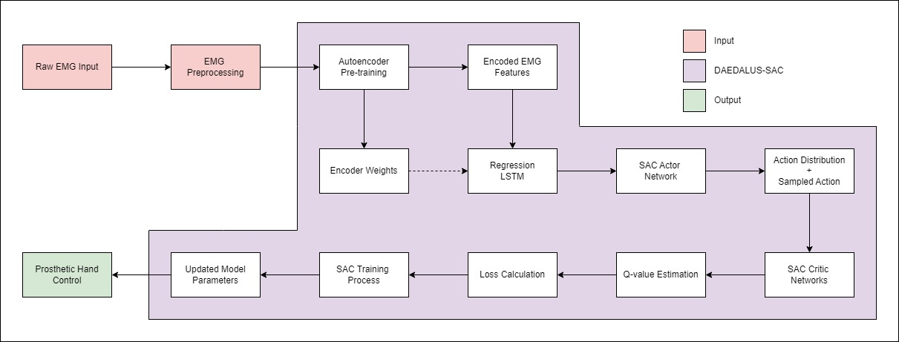

# Run Simulation on Local

Before proceeding, you must follow these documentations:

- [Connect Myo Armband](../docs/local/connect_myo_armband.md)
- [Setup ROS](../docs/local/setup_ros.md)
- [Setup Video Data Recorder](../docs/local/video_data_recorder.md)

## DAEDALUS-SAC Architecture



## Install Requirements

Run the following command to install the required packages:

```bash
pip install -r local/requirements.txt
```

## Run EMG Recording

You can run the script located in `calib_rec_too/video_data_recorder.py` to record EMG data and take a video at the same time.

## Train DAEDALUS-SAC CLI

This CLI tool allows you to run training and optimization pipelines with various options for DAEDALUS-SAC.

### Basic Usage

python local/daedalus_sac/src/train.py [OPTIONS]

### Options

#### General Options

--custom-config TEXT&nbsp;&nbsp;&nbsp;&nbsp;Full path to your custom configuration JSON file

#### Autoencoder Options

--train-autoencoder&nbsp;&nbsp;&nbsp;&nbsp;Flag to train the autoencoder<br>
--autoencoder-pretrained TEXT&nbsp;&nbsp;&nbsp;&nbsp;Full path to the pre-trained autoencoder

#### Regression Options

--train-regression&nbsp;&nbsp;&nbsp;&nbsp;Flag to train the regression model<br>
--regression-pretrained TEXT&nbsp;&nbsp;&nbsp;&nbsp;Full path to the pre-trained regression model

### Examples

1. Run the training pipeline with default settings:

   ```bash
   python local/daedalus_sac/src/train.py
   ```

2. Train the autoencoder:

   ```bash
   python local/daedalus_sac/src/train.py --train-autoencoder
   ```

3. Use a pre-trained autoencoder and train regression:

   ```bash
   python local/daedalus_sac/src/train.py --autoencoder-pretrained /path/to/autoencoder --train-regression
   ```

4. Use custom configuration:

   ```bash
   python local/daedalus_sac/src/train.py --custom-config /path/to/config.json
   ```

5. Train all models:

   ```bash
   python local/daedalus_sac/src/train.py --train-autoencoder --train-regression
   ```

Note: The options for training and using pre-trained models are mutually exclusive for each model type. For example, you can't use both --train-autoencoder and --autoencoder-pretrained at the same time.

## Tensorboard CLI

This script does the following:

1. Launches TensorBoard with logs from autoencoder, regression, and SAC components.
2. Automatically opens the TensorBoard URL in your default web browser.
3. Keeps TensorBoard running until you press `Enter` in console.

### Basic Usage

   ```bash
   python local/daedalus_sac/src/launch_tensorboard.py --run RUN_NUMBER
   ```

### Options

--run TEXT&nbsp;&nbsp;&nbsp;&nbsp;Run number (e.g., 20240710_232601) [required]

## Example

Launch TensorBoard for run number 20240710_232601:

   ```bash
   python local/daedalus_sac/src/launch_tensorboard.py --run 20240710_232601
   ```

## Notes

- The script expects logs to be organized in a specific directory structure:
  logs/run_[RUN_NUMBER]/tensorboard/[component]
  where [component] is one of: autoencoder, regression, sac

- If the browser doesn't open automatically, the TensorBoard URL will be printed in the console.

- The script uses the default configuration. If you need to use a custom configuration, you'll need to modify the script.

- TensorBoard will continue running until you press Enter in the console where you launched the script.

## Troubleshooting

If you encounter issues:

1. Ensure that TensorBoard is installed in your Python environment.
2. Check that the log directories exist and contain valid TensorBoard log files.
3. If the browser doesn't open automatically, manually copy and paste the URL from the console.
